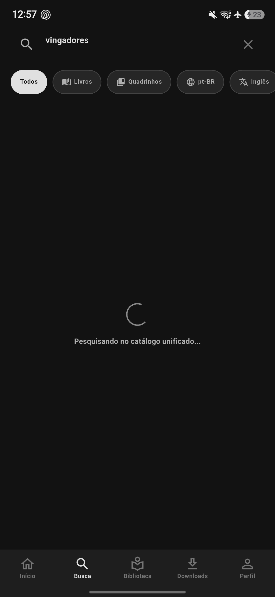

# VANTA Reader

<div align="center">

**An open-source, local-first reader for books and comics built with Flutter.**

[](https://github.com/limaduzz11/vanta-reader/actions/workflows/ci.yml)
[](#downloads--availability)
[](https://github.com/limaduzz11/vanta-reader/releases)
[](https://flutter.dev)
[](https://dart.dev)
[](https://sqlite.org)
[](LICENSE)

<br />

**English** &nbsp;|&nbsp; [Português (Brasil)](README.pt-BR.md)

<br />



</div>

> Read EPUB, TXT, and CBZ files offline.  
> Keep your library and reading progress strictly on your device.  
> No account required.

---

## Table of Contents

- [Supported Formats](#supported-formats)
- [Platform Support](#platform-support)
- [Key Features](#key-features)
- [Architecture](#architecture)
- [Downloads & Availability](#downloads--availability)
- [Build & Test from Source](#build--test-from-source)
- [Contributing](#contributing)
- [Roadmap](#roadmap)
- [License](#license)

---

## Supported Formats

| Format | Content Type | Status | Engine |
| :--- | :--- | :---: | :--- |
| **EPUB** | Books & Novels | `Supported` | Custom Reflowable Parser |
| **TXT** | Plain Text | `Supported` | Chunked Plaintext Engine |
| **CBZ** | Comics & Manga (ZIP bundle) | `Supported` | LRU Cached Image Pipeline |
| **PDF** | Books & Documents | `Planned` | Native Vector Renderer |
| **CBR** | Comics & Manga (RAR bundle) | `Planned` | Decompression Pipeline |

---

## Platform Support

| Platform | Target | Status | Distribution |
| :--- | :--- | :---: | :--- |
| **Android** | Phone & Tablet | `Supported` | APK (GitHub Releases) |
| **Linux** | Desktop (x86_64) | `Supported` | Native Bundle |
| **Windows** | Desktop | `Planned` | Standalone Executable |
| **macOS / iOS** | Desktop / Mobile | `Planned` | Application Bundle |

---

## Key Features

- **Local-First & Offline Storage:** Library metadata, authors, reading progress, and favorites are persisted in an embedded SQLite database (schema v5). Works 100% offline without remote telemetry.
- **Dedicated Reading Engines:**
  - **Books:** EPUB parser with Table of Contents navigation, chapter pagination, and dynamic typography adjustments.
  - **Comics:** CBZ viewer featuring Single-Page mode (pinch-to-zoom 2.2x), continuous vertical scrolling (Webtoon), and right-to-left (RTL) mode for Manga.
  - **LRU Memory Guard:** Decoded comic pages are managed by an in-memory LRU cache (`ComicPageCache`) with page and byte budgets to prevent out-of-memory crashes on high-res scans.
- **Persistent Download Queue:** SQLite-backed download queue with pause/resume support, connection recovery, and checksum validation.
- **Extensible Content Providers:** Decoupled catalog discovery via the abstract `ContentProvider` interface and deterministic deduplication (`WorkIdentitySystem`).
- **Monochromatic Minimalism:** High-contrast dark theme designed for focus, responsive layouts adapting seamlessly between mobile (Bottom Navigation) and tablet (Navigation Rail).

---

## Architecture

VANTA Reader is built following **Clean Architecture** conventions:

```text
lib/
├── core/                   # Parsers, SQLite AppDatabase, LRU cache, and security utilities
├── domain/                 # Pure Dart entities, repository interfaces, and atomic Use Cases
├── data/                   # Repository implementations, local data sources, and catalog providers
└── presentation/           # Flutter UI, screens, widgets, and BLoC state management
```

For in-depth design decisions and patterns, read the [Architecture Documentation](docs/ARCHITECTURE.md).

---

## Downloads & Availability

> **Project Status:** VANTA Reader is currently in **active development**.  
> The application is being stabilized, and pre-built binaries along with full build-from-source guidelines will be published in upcoming milestones.

### Distribution (APK)

The primary distribution channel for VANTA Reader is direct, standalone **Android APK** packages — no third-party app stores, no account registration, and zero trackers:

| Package | Target | Status | Download |
| :--- | :--- | :---: | :--- |
| **Release APK** (Signed) | Android (Phone & Tablet) | `Coming Soon` | Official release channel |
| **Preview Build** (Testing) | Android (Phone & Tablet) | `Available` | [Download v0.3.0-preview](https://github.com/limaduzz11/vanta-reader/releases/tag/v0.3.0-preview) |

#### How to Install (Android Sideload)
1. Download the `.apk` file from the [Releases](https://github.com/limaduzz11/vanta-reader/releases) page directly on your Android device (or download on PC and transfer to device).
2. Open the downloaded APK using your file manager.
3. If prompted, allow installation from this source and confirm install.

---

## Build & Test from Source

Full instructions for building and validating VANTA Reader from source on your local machine (including Flutter SDK setup, Dart environment, Android build tools, and running the automated test suite) will be made available once the core development milestones stabilize.

- **Local Execution:** Source setup guides for running on Linux desktop and Android devices are currently in progress.
- **Automated Tests:** The internal test suite (covering domain Use Cases, BLoCs, SQLite migrations, and parsers) will be documented with public test-runner commands in an upcoming release.

You can follow upcoming milestones in [ROADMAP.md](ROADMAP.md) or inspect architectural patterns in [Architecture Documentation](docs/ARCHITECTURE.md).

---

## Contributing

Contributions are welcome! Please check out [CONTRIBUTING.md](CONTRIBUTING.md) to get started, review our [Code of Conduct](CODE_OF_CONDUCT.md), and explore open issues.

---

## Roadmap

See [ROADMAP.md](ROADMAP.md) for milestone tracking, upcoming features (including PDF and CBR support), and release plans. All release updates are tracked in [CHANGELOG.md](CHANGELOG.md).

---

## License

Published under the [MIT License](LICENSE).

---

<div align="center">
  <sub>Maintained by <b>Eduardo de Lima Paranhos</b> · <b>VANTA Labz</b></sub>
</div>
