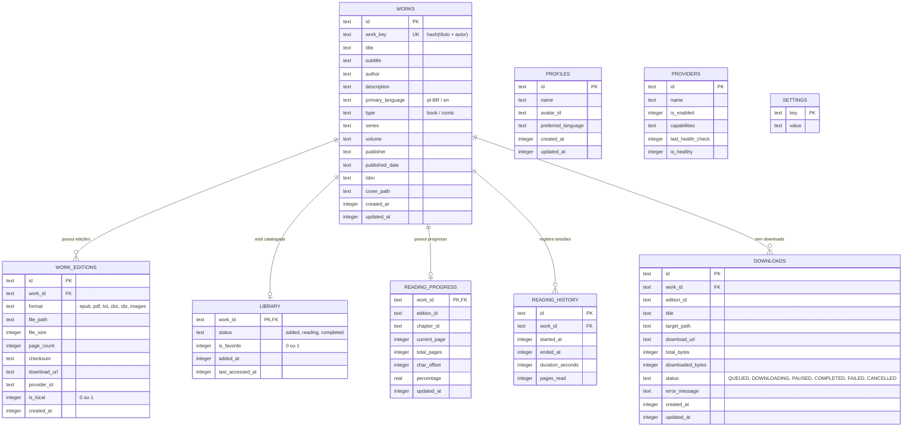

# NOVAREADER — Especificação Técnica do Banco de Dados SQLite
**Documento Canônico:** `docs/DATABASE.md`  
**Data:** 08/09/2026  
**Autor:** NOVA (Plataforma de Engenharia de Software)  
**Status:** IMPLEMENTADO / BASELINE HOMOLOGADA (FASE B)  

---

## 1. Visão Geral e Invariantes
O **NovaReader** utiliza **SQLite nativo** como sua fonte única da verdade para persistência de dados local-first.
- **Arquivo Canônico:** `/NovaReader/database/novareader.db`
- **Modo de Journaling:** `PRAGMA journal_mode = WAL;` (Write-Ahead Logging para permitir leituras concorrentes sem bloqueio durante gravações de downloads ou progresso).
- **Integridade Referencial:** `PRAGMA foreign_keys = ON;` ativa em todas as conexões com deleções em cascata seguras (`ON DELETE CASCADE`).
- **Compatibilidade FFI:** Roda via driver nativo Android no mobile e via `sqflite_common_ffi` no Linux Desktop e suíte de testes unitários.

---

## 2. Diagrama Entidade-Relacionamento (DER)

---

## 3. Índices e Otimização de Performance

Os seguintes índices foram criados para garantir pesquisas e filtros com latência < 5ms:
1. `idx_works_title` (`works(title)`): Otimiza busca textual de obras.
2. `idx_works_author` (`works(author)`): Otimiza agrupamento e busca por autor.
3. `idx_works_type` (`works(type)`): Filtro instantâneo entre Livros e Quadrinhos.
4. `idx_works_language` (`works(primary_language)`): Filtro obrigatório de prioridade `pt-BR` e `en`.
5. `idx_editions_work` (`work_editions(work_id)`): Join de alta performance para recuperar múltiplos formatos de uma obra.
6. `idx_library_favorite` (`library(is_favorite)`): Filtro de favoritos instantâneo.
7. `idx_downloads_status` (`downloads(status)`): Consulta imediata da fila de transferências pendentes.

---

## 4. Política de Migrations e Atualizações
- Todas as evoluções estruturais passam pelo callback `onUpgrade(db, oldVersion, newVersion)`.
- Alterações são rigorosamente aditivas (`ALTER TABLE ADD COLUMN`), preservando integralmente o histórico de leitura e obras baixadas.
