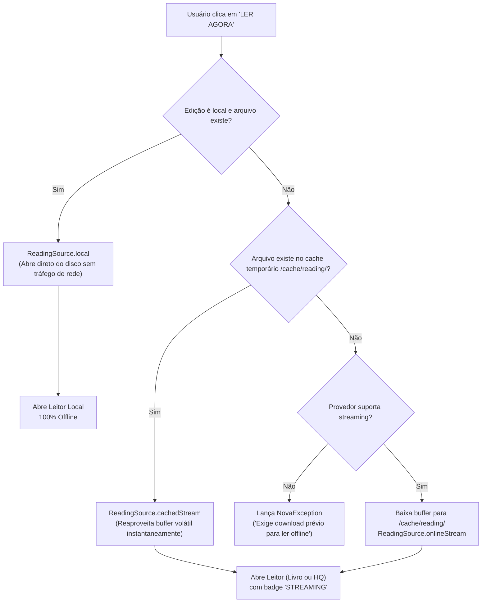

# NovaReader — Leitura Online & Streaming Reader Engine (Fase K)

O módulo de **Leitura Online & Streaming Reader** do NovaReader introduz uma arquitetura híbrida inteligente capaz de abrir e renderizar livros e quadrinhos remotos sob demanda, eliminando a barreira de download prévio obrigatório e mantendo fidelidade estrita ao princípio **Local-First**.

---

## 1. Arquitetura do Subsistema Híbrido

```
lib/
├── core/
│   ├── storage/
│   │   └── storage_manager.dart                # Gerenciamento de /cache/reading/ e clearReadingCache()
│   └── reader/
│       ├── reading_session.dart                # Modelo de sessão híbrida (ReadingSession, ReadingSource)
│       └── online_reading_manager.dart         # Orquestrador de buffer, verificação local e promoção
├── domain/
│   └── usecases/
│       ├── prepare_reading_session_usecase.dart # Resolução transparente de local vs cache vs rede
│       └── promote_reading_session_usecase.dart # Promoção atômica de buffer volátil para armazenamento local
└── presentation/
    ├── blocs/
    │   ├── book_reader/                        # Integração com BookReaderBloc e evento PromoteBookToLocalEvent
    │   └── comic_reader/                       # Integração com ComicReaderBloc e evento PromoteComicToLocalEvent
    └── screens/
        ├── reader/
        │   ├── book_reader_screen.dart         # Badge STREAMING/SALVO e botão "Salvar offline" na AppBar
        │   └── comic_reader_screen.dart        # Badge STREAMING/SALVO e botão "Salvar offline" na AppBar
        └── work_details_screen.dart            # Indicador de disponibilidade (offline vs streaming imediato)
```

---

## 2. Princípios e Estratégia de Leitura Híbrida

A leitura de qualquer obra (`Work` e `WorkEdition`) segue uma hierarquia de três níveis estritos de resolução:



### Nível 1: Armazenamento Local Permanente (`ReadingSource.local`)
- Se a edição já foi importada ou baixada (`edition.isLocal == true` e o arquivo existe fisicamente em `/books/` ou `/comics/`), o leitor abre o arquivo local de forma transparente.
- **Garantia:** Zero conexões de rede ou consumo de dados.

### Nível 2: Cache Volátil de Leitura (`ReadingSource.cachedStream`)
- Se a obra foi aberta anteriormente em streaming e os dados ainda residem no cache volátil (`/cache/reading/`), o arquivo é reaproveitado sem novo download.
- O cache pode ser limpo pelo usuário sem afetar a biblioteca permanente (`storageManager.clearReadingCache()`).

### Nível 3: Streaming sob Demanda (`ReadingSource.onlineStream`)
- Caso o arquivo não esteja nem no armazenamento local nem no cache volátil:
  1. O sistema valida as capacidades do provedor (`capabilities.supportsStreaming`).
  2. Resolve a URL do streaming sob demanda (`provider.resolveDownloadUrl(...)`).
  3. Descarrega o buffer inicial para o arquivo temporário de cache seguro.
  4. Transmite o arquivo para o motor de parsing correspondente (`BookContentParser` ou `ComicContentParser`).

---

## 3. Promoção Inteligente de Buffer para Local (`promoteToLocal`)

Um dos maiores diferenciais de engenharia do NovaReader é a capacidade de promover uma sessão ativa de streaming para um arquivo local permanente **sem necessidade de re-download**:

1. Enquanto lê via streaming, o usuário toca no ícone **"Salvar offline na Biblioteca"** (`Icons.download_for_offline_outlined`).
2. O `OnlineReadingManager`:
   - Copia o arquivo existente em `/cache/reading/` diretamente para a partição permanente de livros (`/books/`) ou quadrinhos (`/comics/`).
   - Atualiza a edição no banco SQLite com `isLocal = true`, novo caminho definitivo e tamanho em bytes.
   - Atualiza o status na tabela `library` para `downloaded`.
   - Atualiza o estado do BLoC em tempo real: o badge altera de `STREAMING` para `SALVO`.
3. Se a internet for desligada imediatamente após a promoção, a obra continua aberta e disponível 100% offline.

---

## 4. Persistência Universal de Progresso no SQLite

Independentemente de a obra ter sido aberta localmente ou via streaming:
- O progresso de leitura (página atual, capítulo, percentual, data de último acesso) é **sempre** persistido na base de dados SQLite local (`reading_progress` e `reading_history`).
- Quando o usuário retornar à mesma obra no futuro (seja em streaming ou após baixá-la), o leitor restaura a página exata em que o usuário parou.

---

## 5. Experiência Visual e Design System

1. **`WorkDetailsScreen`:**
   - Chips de edição sinalizam se a versão já está disponível offline ou para streaming online.
   - Indicador contextual sutil abaixo dos botões de ação:
     - `Icons.check_circle_outline_rounded`: *"Arquivo local no dispositivo (Leitura 100% offline)"*
     - `Icons.wifi_rounded`: *"Streaming online suportado (Leitura instantânea via buffer)"*
2. **`BookReaderScreen` & `ComicReaderScreen`:**
   - Barra superior retrátil com chip monocromático minimalista:
     - `STREAMING` com `Icons.cloud_outlined` durante leitura online.
     - Botão de ação direta para promover a edição para download permanente.
     - Feedback imediato via `SnackBar` monocromática.

---

## 6. Cobertura de Testes Automatizados

A Fase K foi homologada com cobertura exaustiva de testes:

1. **`test/core/reader/online_reading_manager_test.dart`:**
   - Redirecionamento transparente para arquivo local sem tocar na rede.
   - Reaproveitamento de arquivo presente no cache volátil.
   - Streaming de nova edição remota simulada para o cache.
   - Rejeição graciosa caso o provedor não ofereça suporte a streaming.
   - Promoção atômica de cache para armazenamento permanente com validação no SQLite.
   - Limpeza seletiva com `clearReadingCache()` preservando livros permanentes.
2. **`test/domain/usecases/prepare_reading_session_usecase_test.dart`:**
   - Resolução de sessões e execução de promoção via Casos de Uso.
3. **`test/presentation/streaming_reader_bloc_test.dart`:**
   - Fluxo completo em `BookReaderBloc` (Loading -> Loaded Streaming -> PromoteToLocal).
   - Fluxo completo em `ComicReaderBloc` (Loading -> Loaded Streaming -> PromoteToLocal).
4. **`test/core/storage/storage_manager_test.dart`:**
   - Validação da criação do subdiretório `readingCacheDir` e método `clearReadingCache()`.

**Resultado da Suíte Completa:** 133/133 testes passando verde (100%), 0 alertas no `flutter analyze` e build Linux Desktop validado.
